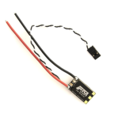

# Implementation of a Thrust Controller for a Drone Motor

## Summary

The goal of this project is to implement a controller allowing to control a drone using the thrust produced by its motors. 

## Process

To do so, this project is divided in [**four main steps**](https://github.com/kevinbecquet/Thrust_Control/tree/master/process):

* Acquisition of the command sent to the ESC
* Acquisition of the thrust produced by the motor
* Sending a signal to the ESC
* Creation of a controller to close the loop

# Electronics

[Here](https://github.com/kevinbecquet/Thrust_Control/tree/master/electronics) are decribed the main components of this system:

|*OpenCM 9.04 MCU board*|*Tiger Motor F35A 3-6s ESC BLHeli_32*|
|---|---|
|||

|*AD620 analog voltage amplifier module*|*Full Wheatstone bridge load cell*|
|---|---|
|||

# How to use the controller

## Wiring

The motor is fixed to the loadcell with a screw.

The amplifier module has been modified to ensure the repetability of the system. [Here](electronics/amplifier/README.md) is the detail of its modification.

## Upload the program in the microcontroller
The board used can be used with the arduino IDE by following [these steps](electronics/microcontroller/README.md)

## Plotting data and sending commands 
To send commands to the motor, read the data from the system, and change configuration of the controller, follow [these steps](plot_ws/README.md)
