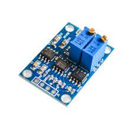
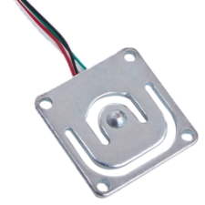
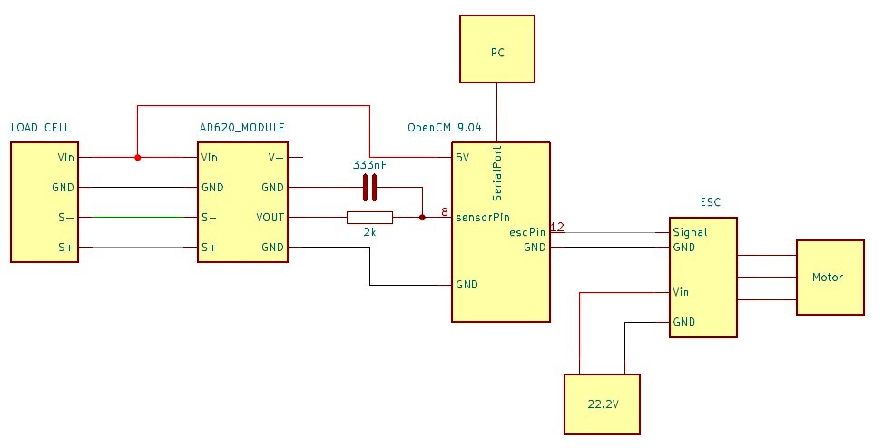

# Electronics

This part sums up all the components used in this system and how they are assembled together.

## Components 
|*OpenCM 9.04 MCU board*|*Tiger Motor F35A 3-6s ESC BLHeli_32*|
|---|---|
|||

|*AD620 analog voltage amplifier module*|*Full Wheatstone bridge loadcell*|
|---|---|
|||

## Wiring

 
*Blocks schematic of the system*

*Electronic schematic of the thrust controller (with the modification of the A620 module)*