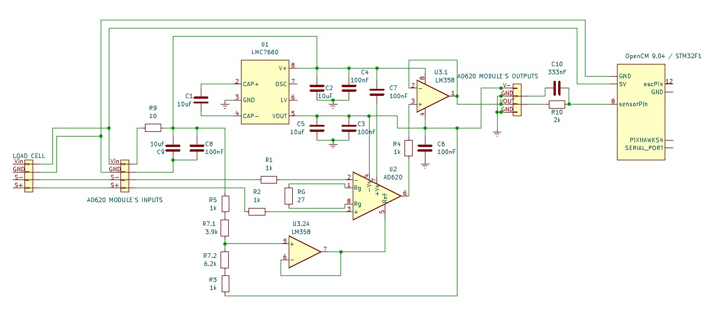

# Electronics

This part sums up all the components used in this system and how they are assembled together.

## Components 

  
*OpenCM 9.04 MCU board*

  
*Tiger Motor F35A 3-6s ESC BLHeli_32*

  
*AD620 analog voltage amplifier module*

  
*Full Wheatstone bridge loadcell*

## Wiring

