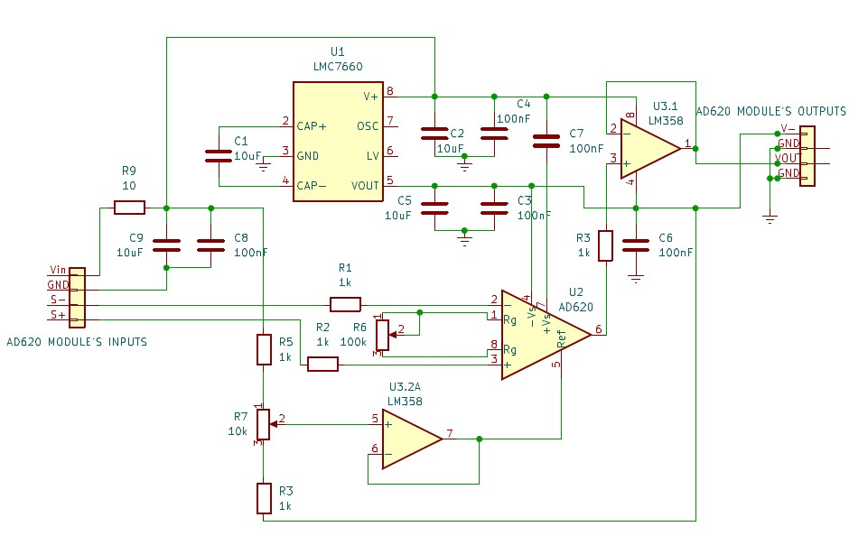

# Amplifier

The amplifier used in this system is an analogic amplifier, AD620 module.  
*AD620 module*
  
*AD620 module electronic schematic*

It has two potentiometers allowing the user to tune both the offset and the gain of the input signal.

However, this module has a voltage inverter allowing to have a -5V from a +5V supply but this component create a noise non negligeable in front of the voltage from the loadcell.
Thus, it is necessary to filter the output signal from the amplifier before sending it to the microcontroller

## Filter the noise

The noise created by the AD620 module has a frequency around 4.5kHz and has a amplitude of 120 mV. Thus, a low pass filter with a cutoff frequency of 4kHz will be necessary.  
  
*Output Signal of the AD620 module when connected to the loadcell*

### Low Pass Filter

The filter that we need to implement has to respect some constraints :

* have a cutoff frequency of at most 4kHz -> have the good ratio between the capacitor and the resistor
* be reactive enough to allow an acquisition -> use a capacitor with a not too high value
* not have an impedance too high compared to the microcontroller one -> use a resistor with a not too high value

The filter implemented is an order 1 low pass filter composed by a capacitor and a resistor.
We can determine its cutoff frequency with the following equation :  
fc = 1/R*C

Thus, this filter is composed by a 2kΩ resistor and a 333nF capacitor.

## Calibration

The force range the system has to detect is from -5N to 25N. Knowing our microprocessor has a maximum input voltage of 3.3V we will tune the gain and the offset in order to have the maximum amplitude between the voltage corresponding to a -5N force and the one corresponding to a 25N force.

Then, as the potentiometers are not that stable (differences of values have been noticed after the chip being unplugged and plugged again) they were replaced by fixed resistors.

### Offset's potentiometer

This potentiometer provides to the system a division of the input voltage. The resistors usable to replace it are found by resolving this system and taking the closest resistors:

### Gain's potentiometer

This one doesn't create a voltage divider but still allow the variation of a resistor :  
**RG=(G-1)/(49.4∙103) = 27Ω**

## Wiring

First replace the potentiometers by the resistors determined earlier. Then, add the components of the low pass filter on the output pin.
Finally, connect the new output to the OpenCM board

  
*AD620 module electronic schematic with potentiometers replaced by resistors*
