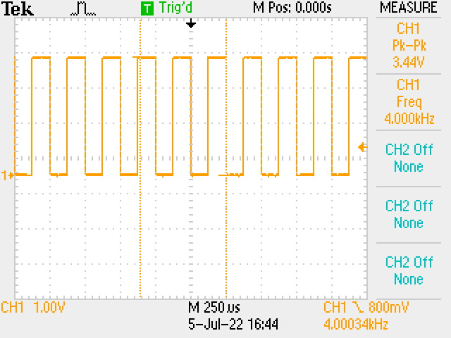
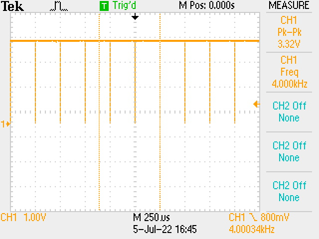

# ESC

  
*Tiger Motor F35A 3-6s ESC BLHeli_32, the ESC used in this system*

The Electronic Speed Controller (ESC) is a component allowing the adjustment of the motor's spin.  
It receives a PWM signal and converts it to a phase shifted signal to make the motor spin.

The protocol used to communicate between the microcontroller and the ESC is the OneShot125 protocol.

## OneShot125

This protocol allow us to send data to the ESC up to a frequency of 4kHz.
With it, the length of the pulse corresponds directly to the speed of the motor using a 125μs pulse to stop the motor and a 250μs pulse to set it to the max value.

  
*OneShot125 Signal at 4kHz at its minimum value*

  
*OneShot125 Signal at 4kHz at its maximum value*
