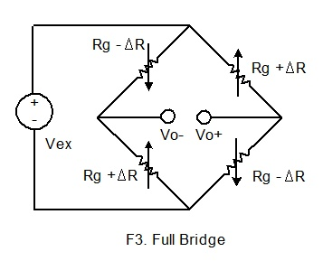
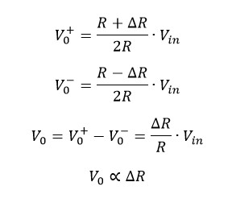

# Load cell working

We need to get the thrust force produced by the motor's rotation  
That's where the load cell will come handy.

## Composition
The load cell used here is composed by a Wheatstone full bridge installed on an  
aluminium plate.

## Wheatstone bridge

This system is initially composed by 4 resistive elements.  
When the load cell isn't loaded, these elements have the same ohmic value : 
R1 = R2 = R3 = R4 = RG

However, when loaded, the force applied on the load cell will deform the aluminium plaque  
which will make 2 resistors value decrease meanwhile the other 2 will increase.

We can determine a linear relation between the input voltage and V0 as the following :

This let us a linear tranfosmartion from the thrust force provided by the motor to a voltage that can be amplified.

## Wiring

The load cell needs to be excited by a voltage of 5V provided by our MCU.

