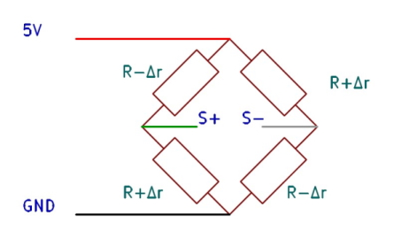
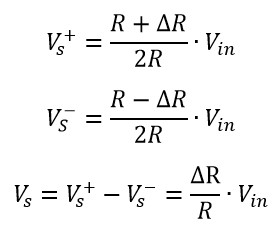

# Load cell 

We need to know how much thrust the motor is producing. A load cell is a sensor capable of converting the forces applied to it into a voltage. 

## Composition
The load cell used here is composed by a Wheatstone full bridge installed on an aluminium plate.

## Wheatstone bridge

This system is initially composed by 4 resistors. When the load cell isn't loaded, these ones have the same value :  
R1 = R2 = R3 = R4 = RG

However, when loaded, the force applied on the load cell will deform the aluminium plaque which will make 2 resistors value decrease meanwhile the other 2 will increase in the same way.  
We can determine a linear relation between the input voltage and the output voltage V0 as the following :

This let us a linear transformation between the thrust force provided by the motor and the output voltage

## Wiring

The load cell needs to be excited by a voltage of 5V provided by our MCU.  
As the use of this component in this system is to detect force from -5N to 24.5N (-0.5kgf to 2.5kgf), the output voltage it sends is about 1 mV per kgf.  
Thus it is necessary to connect the load cell to an [amplifier](https://github.com/kevinbecquet/Thrust_Control/tree/master/electronics/amplifier) before sending the signal to the microcontroller.  

The green wire is connected to the S+ input of the amplifier and the white one, to the S- input.

