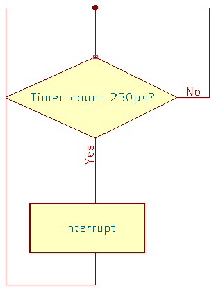
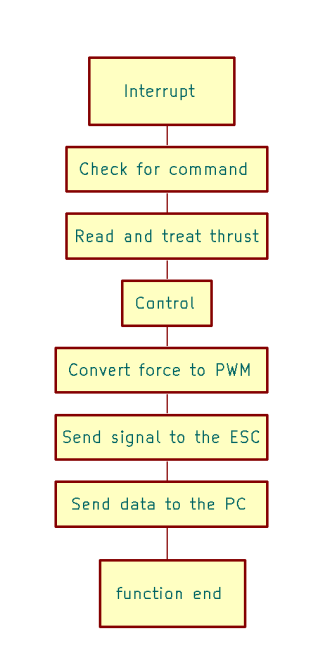
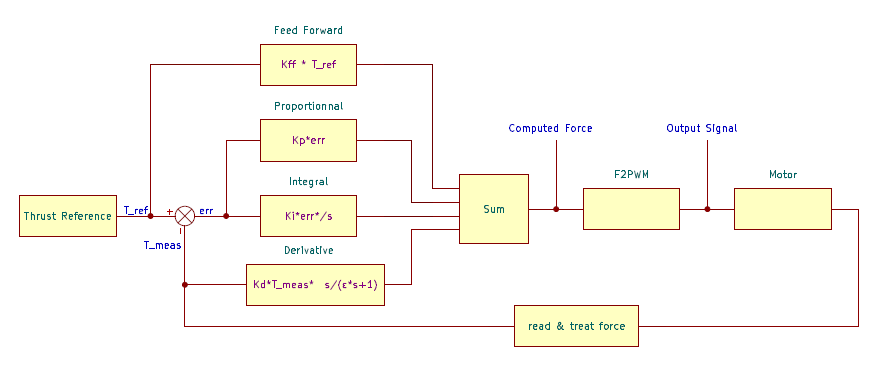

# Process

The implementation of the thrust controller is divided in four main steps :  
* Receive a thrust command 
* Receive the force values sent by the loadcell
* Create the controller determining the signal to send to the ESC
* Sending the desired signal to the ESC

## Timer interruption
As the ESC can receive signal at a frequency of 4kHz, we want the algorithm to be synchronized with it. To do so, the program uses one of the hardware timer of the microcontroller to make an iteration of the algorithm every 250µs.


		       
Once the timer counted 250µs, the program enters the interruption function where it executes an iteration of the code


## Receiving a command
The communication with the microcontroller is made through the serial port. Our system sends its data using a message on one line that has the following structure:  

***measurement,command,controller_output,proportionnal_part,Integral_part,derivative_part,feedforward_part,pulse_sent***  

We can also sent configuration using the following message structure: 

***mode,command,filter_coef,controller_proportionnal_coef,controller_integral_coef,controller_derivative_coef,controller_feedforward_coef***

### Mode
According to the value of the **mode** in your message, the action realised by the system will not be the same:

|Mode|Action|
|-----|-------|
|0|Send a command to the ESC|
|1|Send a controller configuration|
|2|Disable the controller and stop the motor|
|3|Tare the load cell|

To send a command, use the **thrust_command** variable.  
To send a configuration, fill each parameter with the desired values.

As this can be annoying to write and read each time, [a tool has been implemented](../plot_ws/) allowing an easier control of the system and an easier reading of its data by using ros2 and plotjuggler.


## Receiving the force values sent by the loadcell

The loadcell sends an output signal that is linear with the force it receive in input
Thus, the acquisition of the force consists in an analogRead of the output value from the amplifier that is mapped into the corresponding force in N.

#### **Mapping** 

* The mapping between the force and the corresponding value is a linear mapping made using one point and a slope

#### **Calibration**  

* When the microcontroller is powered up, the load cell is tared by getting an average of measurments and making it correspond to 0N.

#### **Filtering**
* When the motor spins, it creates vibrations that noises the thrust measurement making it unusable. 
Thus, the implementation of a low pass filter is necessary.  
The filter used is a 1st order low pass filter such as :
```
out(k) = α*in(k) + (1-α)*out(k-1)
```
Using it allowed us to reduce the noise by 10 times.

## Create the controller determining the signal to send to the ESC

  
The controller used is a PID with a feedforward term added to it.
### Proportionnal
The proportional part of a PID controller computes the error between the measurement and the command and send it to the output.

### Integral
The integral part is limited by an antiwindup threshold stopping the integration in case the system is saturated.

### Derivation
The derivative part derivates the measurement and not the error.  
The derivation operation used is not a proper deriavtion but an approximation of it :  
In the Laplace domain, a derivation becomes a multipication by s (the Laplacian variable). 
However, the derivation used here corresponds to a multiplication by s/(ε*s + 1). This approximation is made to limit the amplification of the noise made by the derivation operation.

### Feedforward
The feed forward term is the response the system would have given to the command if it was in open loop. It doesn’t react with the change in the feedback.  
This term is useful in a controller because it shortens the rising time of the system output allowing a faster stabilization of the measurement around the command overall.
 


## Send the desired signal to the ESC 

The signal sent to the ESC is a pwm signal following the OneShot125 protocol: a throttle of 125μs is the minimum, corresponding to a stopped motor, and a throttle of 250μs is the maximum, corresponding to a motor going at full power.

Thus, to be as fast as possible, the PWM signal that is sent to the ESC has a frequency of 4kHz (and a period of 250μs). Moreover the signal's resolution has been set to 10 bits to be precise enough

#### **Thrust / Signal mapping**

* The relation between the length of the throttle sent to the motor and the thrust produced by the motor is quadratic.  
To map these values making some measurements is necessary. 
Then, we need to find a fitting function in the form  
f(PWM-511) = a\*(PWM-511)² + b\*(PWM-511)  
Where 511 is the minimum length of the throttle sent to the ESC encoded over 10 bits (a duty cycle of  50% corresponds to 511 over 1023).   


Finally, PWM(f) is determined by inverting the function found before with its a and b coeficients.


#### **Calibration** 

* The calibration is made by sending the signal corresponding to the maximum value and then the one corresponding to the minumun value. 

#### **Send signal**

The OpenCM board manager has a pwm driver already implemented.  
* to set the signal's frequency: *drv_pwm_setup_freq(pinOut, FREQ);*
* to set the duty cycle : *drv_pwm_set_duty(pinOut, PWM_RES, dc);* where PWM_RES is the resolution in bit of the duty cycle and dc the duty cycle between 0 and 2^PWM_RES - 1 

\* Some functions of the drv_pwm files of the opencm 9.04 board manager preventing the signal from glitches due to the refreshing of the polarity bit. That's why the microcontroller's program fodler is composed of not only one file.

